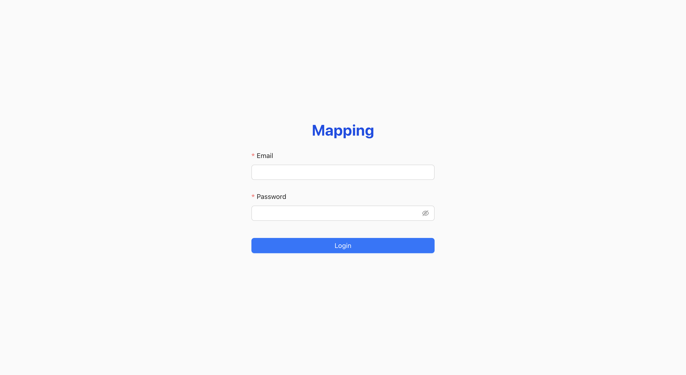
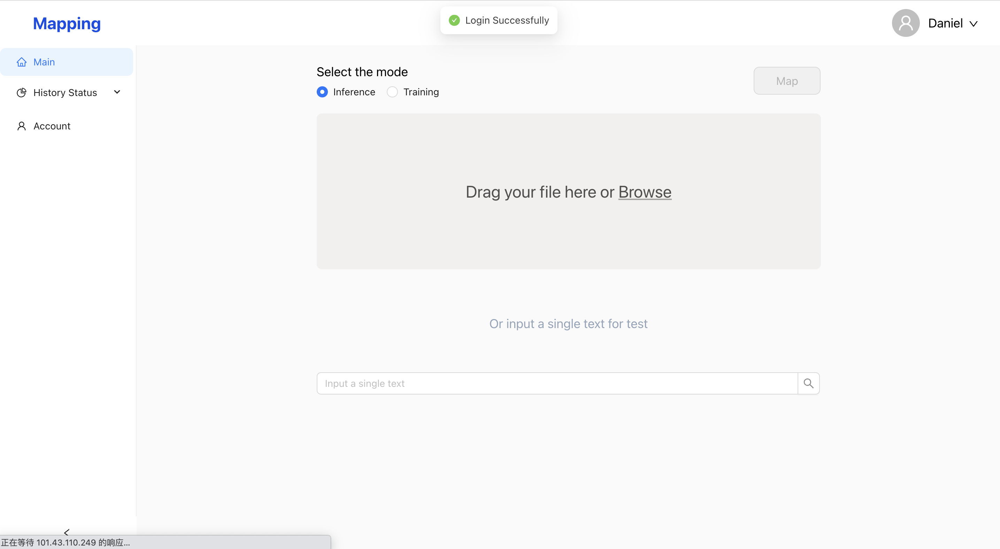
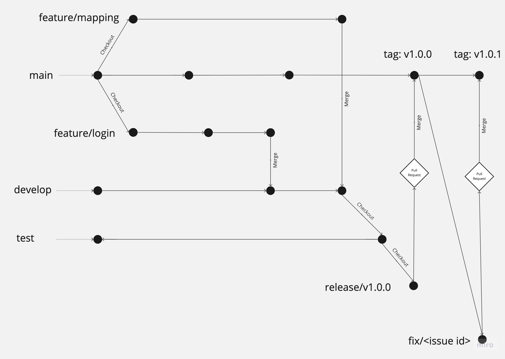

# SNOMED CT Diagnostic and Prescription Mapping Tool
<!--   -->
<!--  -->

<!--  -->

<!--  -->

<!--  -->

## Table of Contents
- [SNOMED CT Diagnostic and Prescription Mapping Tool](#snomed-ct-diagnostic-and-prescription-mapping-tool)
  - [Table of Contents](#table-of-contents)
  - [Background](#background)
  - [Repository Structure](#repository-structure)
  - [Features](#features)
  - [Installation and deployment](#installation-and-deployment)
  - [Requirements](#requirements)
    - [System requirments](#system-requirments)
    - [Environment requirments](#environment-requirments)
  - [Demo and preview](#demo-and-preview)
  - [Prototypes](#prototypes)
  - [Project Workflow](#project-workflow)

## Background

The primary objective of this platform is to determine whether medications prescribed to patients are appropriate by normalizing free-text clinical notes and mapping them to canonical clinical terms.

The platform's primary function is to simplify the process of associating brief free-text descriptions, which generally explain the reasoning behind prescribing specific medications, onto a Universal Indication List (UIL), which serves as a subset of the broader standardized knowledge base of clinical terms known as SNOMED CT.

The platform features the integration of a human-in-the-loop system, which allows for manual review and correction of the mapping results. This feedback will be used to continuously enhance the platform's accuracy and performance.

This curation feature will further streamline the mapping process, ensuring that the most relevant and commonly used clinical terms are easily accessible for healthcare professionals and researchers.

## Repository Structure

Here we list the top-level directory of this repository

More details about the sub-directories can be found in docs directory [repository structure](./docs/wikis/repo_structure.md).

    .
    ├── ansible       # Automated deployment scripts
    ├── data samples  # Sample input for the prototype 
    ├── docs          # Documentation files  
    ├── prototypes    # Designed user interface - prototypes
    ├── src           # Source code
    ├── tests         # Code pieces and automated tests of source code
    ├── LICENSE       # <Not included for now>
    ├── README.md
    └── .gitignore

## Features
* Map clinical free text to Universal Indication List(UIL - a subset of SNOMED CT)
* Curate mapping result category
* Continuously improve mapping performance
* Download mapping result
* Collaborate with team members
* Rollback the system
* Data protection

## Installation and deployment
1. Clone the repository:

    `git clone https://github.com/COMP90082-2023-SM1/DI-Boxjelly.git`

2. In the command line, go to the ansible directory

        cd ansible

3. Install the ansible requirments:

        ansible-galaxy install -r requirements.yml

4. Modify the inventory configuration in the *inventory.ini* file to the host your wanna deploy this system

5. Use ansible for auto-deployment:

        ansible-playbook -i inventory playbook.yaml

## Requirements

### System requirments

| Resource      	| Minmum 	| Recommended 	|
|---------------	|--------	|-------------	|
| CPUs or Cores 	|   4     	|      8      	|
| RAM           	|   4G     	|     16G      	|
| Storage/Disk  	|   20G    	|     >=40G    	|

### Environment requirments
* Python 3.9+
* Docker  
Following the [offical docker installation](https://docs.docker.com/engine/install/ubuntu/)
* Ansible  
        
        pip install ansible  

    or  

        conda install ansible

## Demo and preview
A demo video is available:

## Prototypes
The following is the main page of this project, and more prototypes available in the prototype directory.

## Video Demos

### Sprint 2 Demo

https://user-images.githubusercontent.com/67616322/235067513-8060098a-a458-4f19-80a3-cb553d260d1f.mp4

## Project Workflow

Team members follow the following version control convention and branch naming convention when developing code.

More detail how to follow the workflow please visits [workflow](./docs/wikis/workflow.md)

