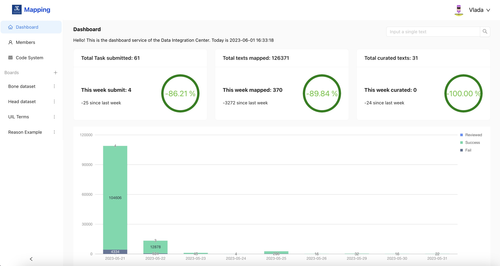

# SNOMED CT Diagnostic and Prescription Mapping Tool

<!--  -->
<!--  -->

## Table of Contents
- [SNOMED CT Diagnostic and Prescription Mapping Tool](#snomed-ct-diagnostic-and-prescription-mapping-tool)
	- [Table of Contents](#table-of-contents)
	- [Background](#background)
	- [Repository Structure](#repository-structure)
	- [Features](#features)
	- [Requirements](#requirements)
		- [System requirments](#system-requirments)
		- [Prerequisites (for Windows/Windows Server)](#prerequisites-for-windowswindows-server)
		- [Prerequisites (for Ubuntu Linux)](#prerequisites-for-ubuntu-linux)
		- [Prerequisites (for macOS)](#prerequisites-for-macos)
		- [Ontoserver Licensing and Setup](#ontoserver-licensing-and-setup)
		- [MedCAT Model Setup](#medcat-model-setup)
		- [Environment Variables Setup](#environment-variables-setup)
	- [Installation and deployment](#installation-and-deployment)
	- [Website Demo](#website-demo)
	- [Website Preview](#website-preview)
		- [Login:](#login)
		- [Dashboard:](#dashboard)
		- [Team Management](#team-management)
		- [Invite Members](#invite-members)
		- [Code System](#code-system)
		- [Map Task](#map-task)
		- [Map Result](#map-result)
		- [Map Result Visualisation](#map-result-visualisation)
		- [Curation](#curation)
	- [Project Workflow](#project-workflow)

## Background

The primary objective of this platform is to determine whether medications prescribed to patients are appropriate by normalizing free-text clinical notes and mapping them to canonical clinical terms.

The platform's primary function is to simplify the process of associating brief free-text descriptions, which generally explain the reasoning behind prescribing specific medications, onto a Universal Indication List (UIL), which serves as a subset of the broader standardized knowledge base of clinical terms known as SNOMED CT.

The platform features the integration of a human-in-the-loop system, which allows for manual review and correction of the mapping results. This feedback will be used to continuously enhance the platform's accuracy and performance.

This curation feature will further streamline the mapping process, ensuring that the most relevant and commonly used clinical terms are easily accessible for healthcare professionals and researchers.

## Repository Structure

Here we list the top-level directory of this repository

More details about the sub-directories can be found in docs directory [repository structure](./docs/wikis/repo_structure.md).

	.
	├── .github       # CI/CD Github Action scripts
	├── data samples  # Sample input for the prototype
	├── docs          # Documentation files
	├── prototypes    # Designed user interface - prototypes
	├── src           # Source code
	├── tests         # Code pieces and tests of source code
	├── LICENSE       # <Not included for now>
	├── docker-compose.yml  # deploy other services exclude ontoserver
	├── ontoserver-docker-compose.yml   # deploy ontoserver
	├── README.md
	└── .gitignore

## Features

- Map: Translate clinical texts to Universal Indication List and SNOMED-CT
- Curate: Manually map result category to continuously improve mapping performance
- Visulization: Mapping result visulization
- Download: Export the mapping result
- Dashboard: System performance visulization
- Team: Member management
- Code system: Update code system version

## Requirements

### System requirments

| Resource      | Minmum | Recommended |
| ------------- | ------ | ----------- |
| CPUs or Cores | 4      | 8           |
| RAM           | 8G     | 16G         |
| Storage/Disk  | 20G    | >=40G       |

### Prerequisites (for Windows/Windows Server)
Ensure that the following software is installed:

1. Windows Subsystem for Linux (WSL): Follow the [official Microsoft WSL Installation Guide](https://learn.microsoft.com/en-us/windows/wsl/install).

2. Docker: Download [Docker for Windows](https://docs.docker.com/desktop/install/windows-install/) from the Docker website and install it.

3. Docker Compose: Docker Compose is included in the Docker Desktop installation package.

4. Node.js and Yarn: Download and install Node.js from the [official Node.js website](https://nodejs.org/en/download). After installing Node.js, install Yarn by following the instructions on the [Yarn website](https://classic.yarnpkg.com/en/docs/install/#windows-stable).

Ensure that you select the option to use WSL 2 as the default when installing Docker.

### Prerequisites (for Ubuntu Linux)
Ensure that the following software is installed:

1. Docker: Follow the official [Docker installation guide for Ubuntu](https://docs.docker.com/engine/install/ubuntu/) to install it.

2. Docker Compose: After Docker is installed, follow the [Docker Compose installation guide](https://docs.docker.com/compose/install/).

3. Node.js and Yarn: Download and install Node.js and Yarn by running the following commands in the terminal:

		sudo apt update
		sudo apt install nodejs
		sudo apt install npm
		sudo npm install --global yarn

### Prerequisites (for macOS)
Ensure that the following software is installed:

1. Docker: Download Docker Desktop for Mac from the [Docker website](https://docs.docker.com/desktop/install/mac-install/) and install it.

2. Docker Compose: Docker Compose is included in the Docker Desktop installation package.

3. Node.js and Yarn: Download and install Node.js from the [official Node.js website](https://nodejs.org/en/download). After installing Node.js, install Yarn by following the instructions on the [Yarn website](https://classic.yarnpkg.com/lang/en/docs/install/#mac-stable).

### Ontoserver Licensing and Setup
- Root permission required
- Ontoserver license:
- Within Australia, email help@digitalhealth.gov.au to request a (free) Ontoserver licence. ADHA will then arrange authorisation for your quay.io account
- Elsewhere, email ontoserver-support@csiro.au to discuss licensing terms (both evaluation and production licences are available for single and multiple instances with no limit on the number of users). Once the licence is established, CSIRO will register your quay.io account name to enable access to their repository
- Note: The license is provided for either individual or organisation. University of Melbourne holds an active license, if you would like to use the license from Unimelb, please contact who is responsible for the Ontoserver license at Unimelb.
- Once you have a license and have access to the Ontoserver image on quay.io, remember to change the `CLIENT_ID` and `CLIENT_SECRET` in the `docker-compose.yml`. For information on how to retrieve these credentials, please consult the [Ontoserver documentation](https://ontoserver.csiro.au/docs/6.1/config-syndication.html#Australian_NCTS_Syndication).

- Ensure your dockerhub account has been registered with ontoserver-support@csiro.au
- Docker login to quay.io required

### MedCAT Model Setup
1. Download the model by [following this link](https://uts.nlm.nih.gov/uts/login?service=https://medcat.rosalind.kcl.ac.uk/auth-callback) and sign into your NIH profile / UMLS license. 
2. You will then be redirected to the MedCAT model download form. Please complete the form and you will be provided a download link.
3. Unzip the downloaded model, rename the folder as `medcat_model` and move it under `DI-Boxjelly/src/di-map` folder.

Ensure that you select the option to use model of SNOMED International (Full SNOMED modelpack trained on MIMIC-III).

### Environment Variables Setup
Environment variables are used in this project to manage different configurations for different environments (development, production, etc.). In particular, REACT_APP_PROD_BASE_URL and REACT_APP_PROD_DOMAIN_URL are required.

1. In the directory of the `DI-Boxjelly/src/di-web`, create a new file named .env.

2. Open the .env file and define the environment variables in the following format:

		REACT_APP_PROD_BASE_URL=http://localhost:8000
		REACT_APP_PROD_DOMAIN_URL=http://localhost

	Replace http://localhost:8000 and http://localhost with the appropriate URL of your production server and domain, especially if you're running on a remote instance.

## Installation and deployment

1. Clone the repository:

		git clone https://github.com/COMP90082-2023-SM1/DI-Boxjelly.git

	Or unzip the provided package to a suitable location on your system.

2. (For Windows users) Open the WSL terminal. You can do this by opening the Start menu, typing "WSL", and selecting the WSL application. Alternatively, open a command prompt and type `wsl` to switch to the Linux environment.

3. Navigate into the project repository:

		cd DI-Boxjelly

	(For Windows users) The Windows file system can be accessed under `/mnt/` in WSL. For example, if you unzipped the package to `C:\myproject\DI-Boxjelly` on your Windows file system, you can access it in WSL with the following command:

		cd /mnt/c/myproject/DI-Boxjelly

4. Docker login to quay.io following instruction in [Ontoserver Licensing and Setup](#ontoserver-licensing-and-setup)

5. Run the setup script:

		sudo ./setup.sh

	(For Windows users) Run the setup script:

		sudo apt-get install dos2unix
		dos2unix setup.sh
		sudo bash ./setup.sh

	- The setup script automates the installation and deployment process.
	- This allows you to have 8 containers: mongo, di-gateway, di-auth, di-center, di-map, nginx, ontoserver and ontoserver-db.

	Note: `sudo` runs commands with administrative privileges, which may ask for your system password.

## Website Demo

A demo video is available:

## Website Preview

### Login:

### Dashboard:

### Team Management

### Invite Members

### Code System

### Map Task

### Map Result

### Map Result Visualisation

### Curation

## Project Workflow

Team members follow the following version control convention and branch naming convention when developing code.

More detail how to follow the workflow please visits [workflow](./docs/wikis/workflow.md).

