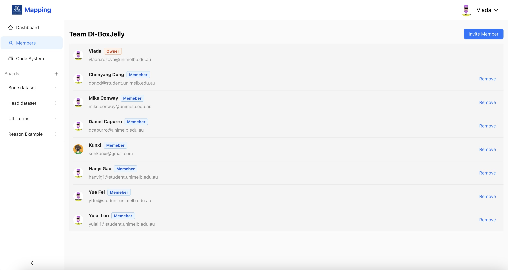
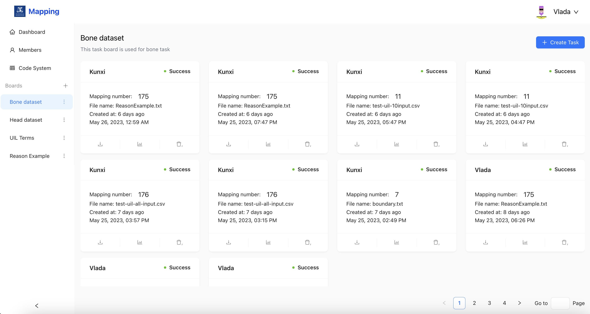
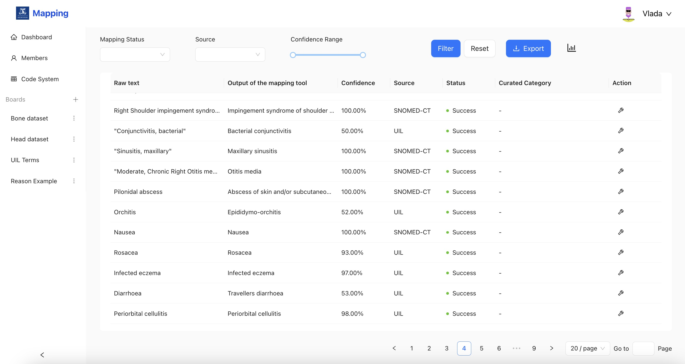
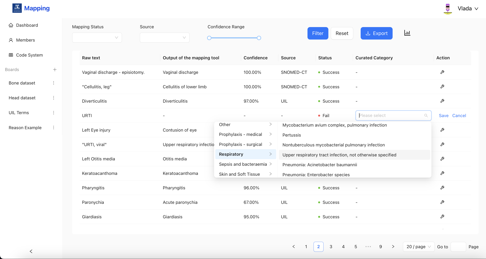

# SNOMED CT Diagnostic and Prescription Mapping Tool
<!--   -->
<!--  -->

<!--  -->

<!--  -->

<!--  -->

<!--  -->

## Table of Contents
- [SNOMED CT Diagnostic and Prescription Mapping Tool](#snomed-ct-diagnostic-and-prescription-mapping-tool)
  - [Table of Contents](#table-of-contents)
  - [Background](#background)
  - [Repository Structure](#repository-structure)
  - [Features](#features)
  - [Installation and deployment](#installation-and-deployment)
  - [Requirements](#requirements)
    - [System requirments](#system-requirments)
    - [Environment requirments](#environment-requirments)
  - [Website Demo](#website-demo)
  - [Website Preview](#website-preview)
        - [Main page:](#main-page)
        - [Mapping result (Inference Mode):](#mapping-result-inference-mode)
        - [Mapping result (Training Mode):](#mapping-result-training-mode)
  - [Project Workflow](#project-workflow)

## Background

The primary objective of this platform is to determine whether medications prescribed to patients are appropriate by normalizing free-text clinical notes and mapping them to canonical clinical terms.

The platform's primary function is to simplify the process of associating brief free-text descriptions, which generally explain the reasoning behind prescribing specific medications, onto a Universal Indication List (UIL), which serves as a subset of the broader standardized knowledge base of clinical terms known as SNOMED CT.

The platform features the integration of a human-in-the-loop system, which allows for manual review and correction of the mapping results. This feedback will be used to continuously enhance the platform's accuracy and performance.

This curation feature will further streamline the mapping process, ensuring that the most relevant and commonly used clinical terms are easily accessible for healthcare professionals and researchers.

## Repository Structure

Here we list the top-level directory of this repository

More details about the sub-directories can be found in docs directory [repository structure](./docs/wikis/repo_structure.md).

    .
    ├── .github       # CI/CD Github Action scripts
    ├── data samples  # Sample input for the prototype
    ├── docs          # Documentation files
    ├── prototypes    # Designed user interface - prototypes
    ├── src           # Source code
    ├── tests         # Code pieces and tests of source code
    ├── LICENSE       # <Not included for now>
    ├── docker-compose.yml  # deploy other services exclude ontoserver
    ├── ontoserver-docker-compose.yml   # deploy ontoserver
    ├── README.md
    └── .gitignore

## Features

- Map: translate clinical texts to Universal Indication List and SNOMED-CT
- Curate: mapping result category to continuously improve mapping performance
- Visulization: mapping result visulization
- Download: Export the mapping result
- Dashboard: system performance visulization
- Team: Member mangement
- Code system: Update code system version

## Installation and deployment

Make sure your instance has docker and docker compose plugin installed

1. Clone the repository:

    `git clone https://github.com/COMP90082-2023-SM1/DI-Boxjelly.git`

2. Deploy the Ontoserver, make sure you have access to the Ontoserver image.(Docker login required)

        docker-compose -f ontoserver-docker-compose.yml up -d

Note: The ontoserver-docker-compose.yml file is downloaded from [here](https://quay.io/repository/aehrc/ontoserver), make sure to ask for permission to get access for this image. After you get the access, remember to change the client id and client secrete in the file. ID and secret can obtain from [NCTS](https://www.healthterminologies.gov.au/).

3. Run the final command

    docker-compose up -d

Note: Deploy di-map and di-web may take some times. Build the image of di-map requires to download medcat which is a large python package. Deploy di-web requires to install many frontend dependencies and then build the production static web files. However, when you made any changes on website, you only need to send the file to **/data/nginx/html** directory on your deployment instance. 

## Requirements

### System requirments

| Resource      | Minmum | Recommended |
| ------------- | ------ | ----------- |
| CPUs or Cores | 4      | 8           |
| RAM           | 8G     | 16G         |
| Storage/Disk  | 20G    | >=40G       |

### Environment requirments

- Docker: Following the [offical docker installation](https://docs.docker.com/engine/install/ubuntu/)

- Ontoserver: Make sure you have the access to Ontoserver, and the client_id, client secrete requireed by Ontoserver docker compose file

## Website Demo

A demo video is available:

## Website Preview
### Login:

### Dashboard:

### Team members

### Invite members

### Code system 

### Map Task

### Map result

### Curate

## Project Workflow

Team members follow the following version control convention and branch naming convention when developing code.

More detail how to follow the workflow please visits [workflow](./docs/wikis/workflow.md)

