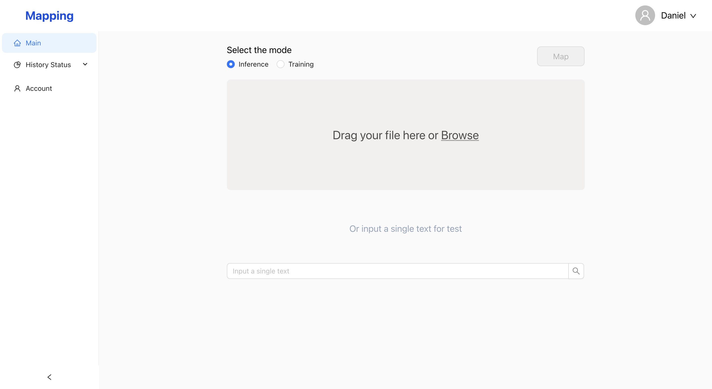
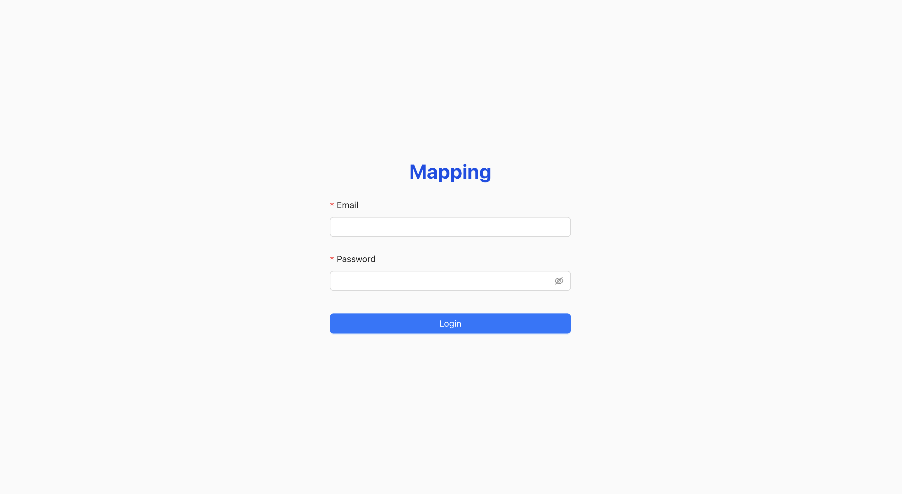

Features:

1. System Docker architecture:
2. Nginx->Web build files from yarn build
3. Nginx->Backend di-gateway
4. di-gateway->di-auth
5. di-auth->mongodb
6. Login( Page and API)
7. Register(Only API)
8. Ansible auto deployment on remote instance
9. Ansible auto deployment on local instance
10. Send Email (Demo)
A basic front end page:

