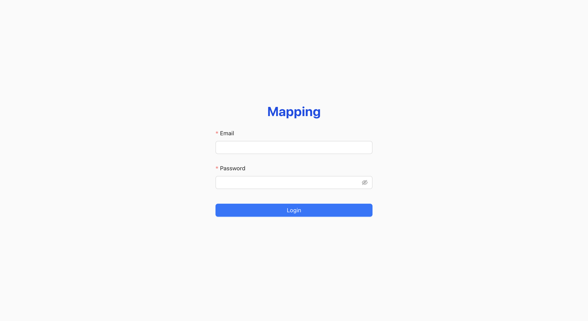
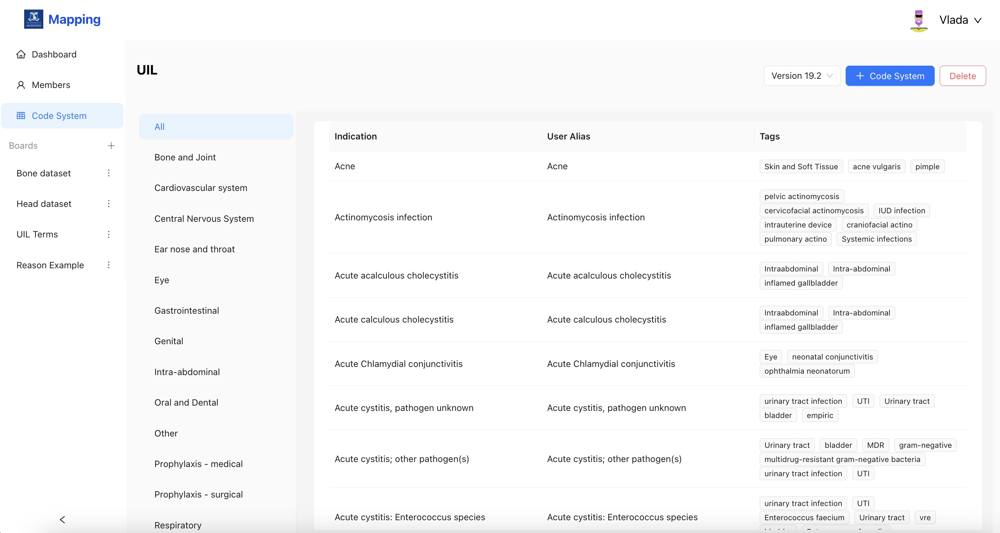

## Features

- Map: translate clinical texts to Universal Indication List and SNOMED-CT
- Curate: mapping result category to continuously improve mapping performance
- Visulization: mapping result visulization
- Download: Export the mapping result
- Dashboard: system performance visulization
- Team: Member mangement
- Code system: Update code system version

## Website Preview
### Login:

### Dashboard:

### Team members

### Invite members

### Code system 

### Map Task

### Map result

### Curate

